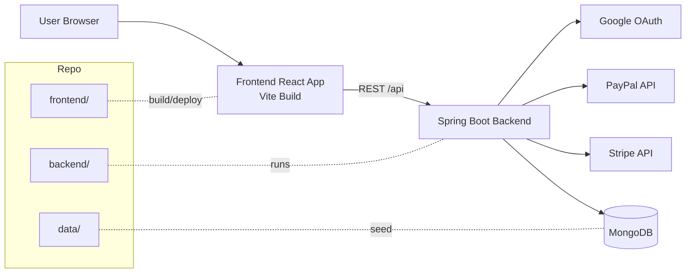
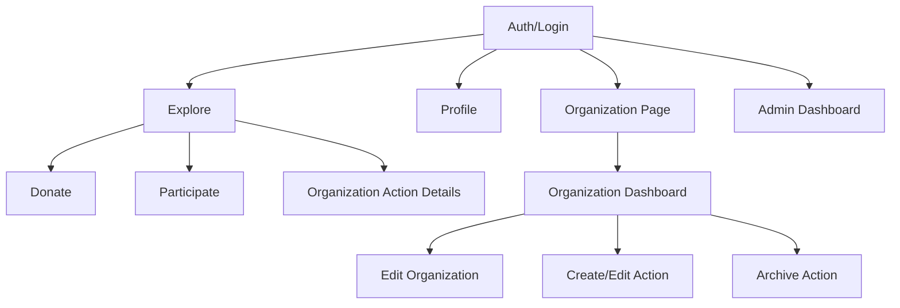
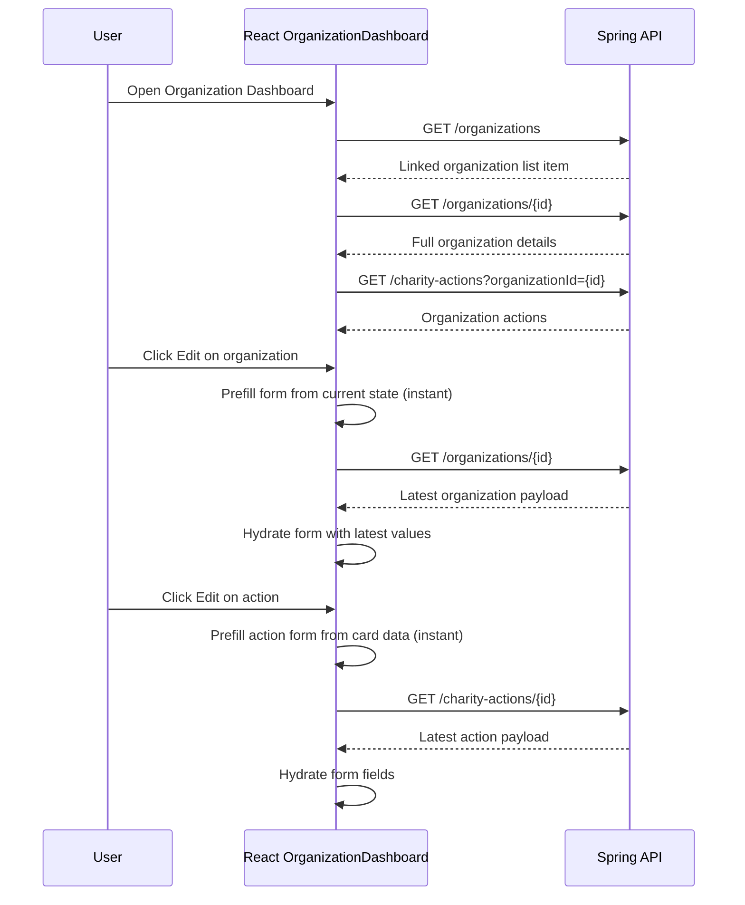
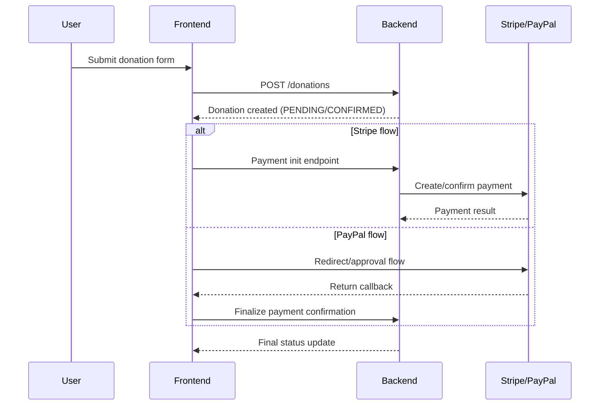

# Gestion Charite

Gestion Charite is a full-stack charity platform to manage organizations, charity actions, donations, and participation in one application.

The repository contains:
- A Spring Boot backend (REST API + admin templates)
- A React + TypeScript frontend (Vite)
- MongoDB persistence
- Docker setup for local development

## Latest Changes (May 2026)

### Functional Updates
- Organization Dashboard now loads fresh data before editing organization details.
- Charity Action edit form now preloads existing values immediately, then hydrates with latest API data.
- Dashboard refresh logic now fetches organization details endpoint (`/organizations/{id}`) after identifying linked org.
- Action category prefill supports both `categoryName` and `category` payload variants.

### UI/UX Updates
- Fixed unreadable white text in dashboard form fields by enforcing readable input text color and background.
- Improved placeholder and select option contrast in organization dashboard forms.

## Core Features

- User authentication and profile management
- Organization creation and organizer dashboard
- Charity action creation, editing, archiving, and tracking
- Donation flows with Stripe and PayPal
- Participation workflows and participation history
- Admin interface for organization/action governance
- Google OAuth support on backend

## Tech Stack

- Backend: Spring Boot 3.5.x, Spring Web, Spring Data MongoDB, Thymeleaf
- Frontend: React 19, TypeScript, Vite, Bootstrap
- Database: MongoDB
- API base path: `/api`

## Repository Structure

- `backend/` Java backend API and admin templates
- `frontend/` React application
- `data/` Seed JSON files
- `docker-compose.yml` Local containers (MongoDB, backend, frontend)
- `Dockerfile.backend` Backend image definition
- `Dockerfile.frontend` Frontend image definition
- `nginx.conf` Frontend serving/proxy configuration

## Project Management Dossier (Soutenance)

To justify the full development approach during soutenance, use these project-management artifacts:

- `docs/GESTION_PROJET.md` lifecycle, planning, milestones, risks, and presentation script
- `docs/ENTREPRENEURIAT_PFA.md` structured entrepreneurship guide and checklist (market, feasibility, finance, legal)
- `TODO.md` operational tracking and correction plan
- `UML.md` use cases, class model, activity and sequence diagrams
- `docs/diagrams/*.mmd` source Mermaid diagrams used in documentation
- `docs/diagrams/pm_*.mmd` project-management diagrams (lifecycle, gantt, WBS, risk plan, governance)
- `docs/diagrams/pm_*.pdf|svg` exported visuals ready for report and presentation
- `rapport.tex` final report integrating project management and technical modules

## Architecture Diagram



## Frontend Navigation Diagram



## Organization Dashboard Edit Data Flow



## Donation and Payment Flow



## Prerequisites

- Java 17+
- Node.js 20+
- npm 10+
- Docker Desktop (optional, for compose workflow)

## Environment Variables

### Frontend (`frontend/.env`)

- `VITE_API_URL` API base URL (example: `http://localhost:8080/api`)
- `VITE_PAYPAL_CLIENT_ID` PayPal client id
- `VITE_STRIPE_PUBLISHABLE_KEY` Stripe publishable key

### Backend

- `SPRING_DATA_MONGODB_URI`
- `GOOGLE_CLIENT_ID`
- `GOOGLE_CLIENT_SECRET`
- `GOOGLE_REDIRECT_URI` (default `http://localhost:8080/api/auth/google/callback`)
- `APP_FRONTEND_URL` (default `http://localhost:5173`)

## Deployment

### Frontend on Vercel

Set the Vercel project root to `frontend/` and add these environment variables:

- `VITE_API_URL` set to your Railway backend URL, for example `https://<your-railway-backend-domain>/api`
- `VITE_PAYPAL_CLIENT_ID` if you use PayPal in production
- `VITE_STRIPE_PUBLISHABLE_KEY` if you use Stripe in production

The frontend includes a `vercel.json` rewrite so direct navigation to client routes keeps working after refresh.

### Backend on Railway

Configure Railway with the backend Dockerfile and set the backend environment variables there:

- `SPRING_DATA_MONGODB_URI`
- `GOOGLE_CLIENT_ID`
- `GOOGLE_CLIENT_SECRET`
- `GOOGLE_REDIRECT_URI` pointing to the Railway backend callback URL
- `APP_FRONTEND_URL` pointing to the Vercel frontend URL

## Run Locally

### Option 1: Docker Compose

From repository root:

```powershell
docker compose up --build
```

Expected services:
- MongoDB on `27017`
- Backend on `8080`
- Frontend on `3000` (containerized)

### Option 2: Run Services Separately

Start backend:

```powershell
cd backend
.\mvnw.cmd spring-boot:run
```

Start frontend:

```powershell
cd frontend
npm install
npm run dev
```

Frontend dev server default: `http://localhost:5173`

## Main API Areas

Base URL: `http://localhost:8080/api`

- `/auth` authentication and OAuth callbacks
- `/users` users and user profile data
- `/organizations` create/list/update organizations
- `/charity-actions` manage charity actions
- `/donations` donation records
- `/participations` participation records
- `/payments` payment confirmation/finalization
- `/admin` admin operations

## Build and Verification

### Frontend

```powershell
cd frontend
npm run build
npm run lint
```

### Backend

```powershell
cd backend
.\mvnw.cmd test
```

## Notes

- Backend seeds initial data when the database is empty.
- Docker Compose persists MongoDB data with a named volume.
- Frontend has a payment finalization path for Stripe/PayPal redirects.

## License

No explicit license file is included yet.
