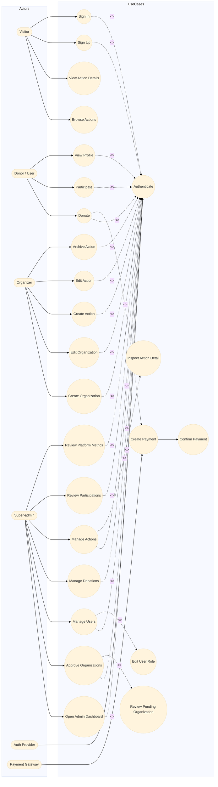
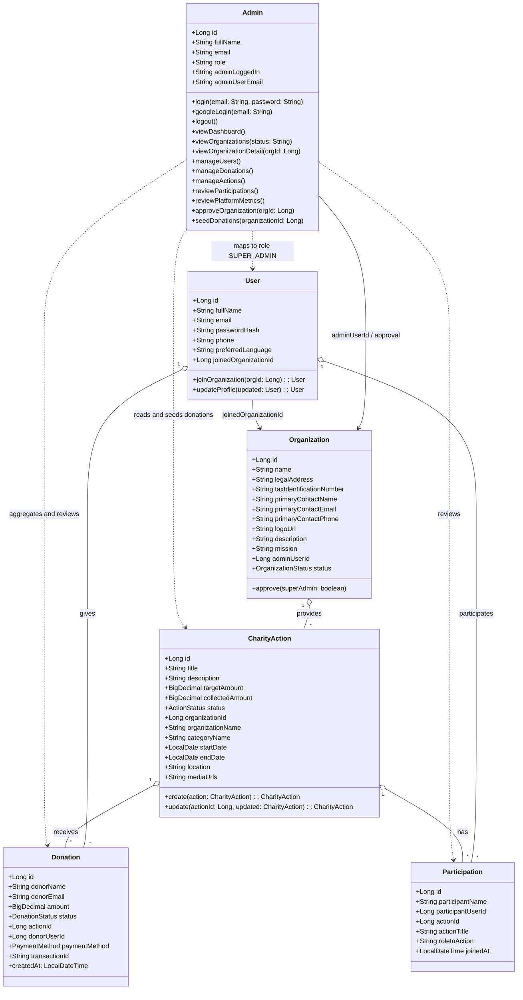
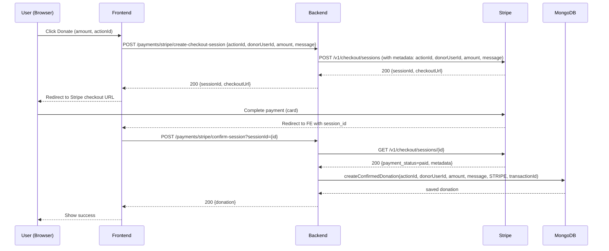
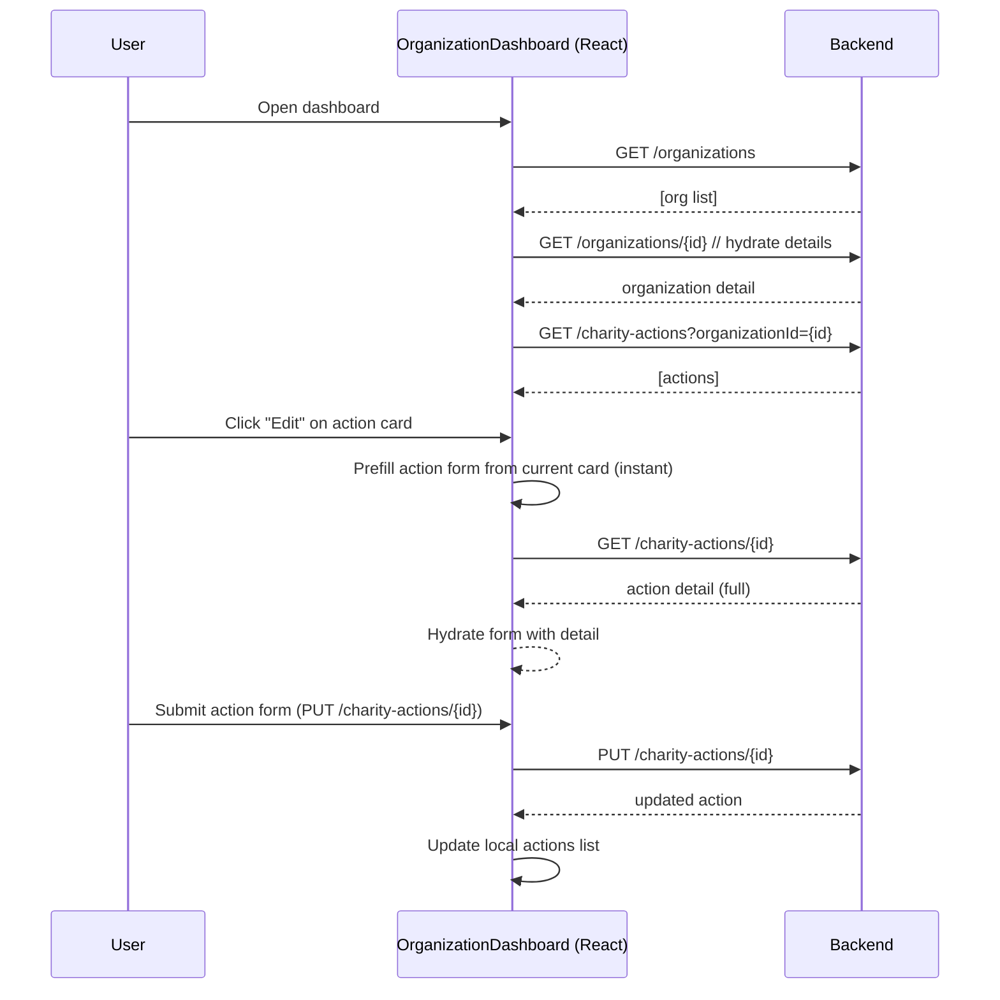

# UML Diagrams for Gestion Charite

This file contains detailed UML diagrams (Mermaid) representing Use Cases, Class model, Activity flows, and Sequence diagrams for the Gestion Charite project. The diagrams include include/extend relationships and important fields, operations, and interactions.

---

## 1) Use Case Diagram - Public, Organizer and Admin



---

---

## 2) Class Diagram (simplified, with key attributes and operations)



---

## 4) Activity Diagram: Organization Edit Flow (including include/extend details)

```mermaid
flowchart TD
  Start([Start]) --> LoadOrg[Load organization list (/api/organizations)]
  LoadOrg --> Found{Organization linked to user?}
  Found -- No --> ShowNoOrg[Show "No organization" message]
  Found -- Yes --> SetOrg[Set organization state]
  SetOrg --> LoadActions[Load actions (/api/charity-actions?organizationId={id})]
  LoadActions --> Idle[Idle]

  Idle --> ClickEditOrg[User clicks Edit Organization]
  ClickEditOrg --> PrefillLocal[Prefill form from state immediately]
  PrefillLocal --> AsyncHydrate[Async fetch /api/organizations/{id}]
  AsyncHydrate --> Hydrated{Detailed payload received?}
  Hydrated -- Yes --> ReplaceForm[Replace form values with fresh data]
  Hydrated -- No --> KeepLocal[Keep local prefill]
  ReplaceForm --> UserEdits[User edits fields]
  KeepLocal --> UserEdits

  UserEdits --> Submit[Submit form -> PUT /api/organizations/{id}]
  Submit --> SaveOk{200 OK?}
  SaveOk -- Yes --> Refresh[Refresh organization and actions]
  SaveOk -- No --> ShowError[Show error]
  Refresh --> End([End])

  %% include/extend
  UserEdits -->|includes| Validate[Validate required fields]
  Validate -->|extends on error| ShowValidationErrors[Show validation errors]
```

---

## 5) Sequence Diagram: Donation (Stripe) flow (detailed)



---

## 6) Sequence Diagram: Organization Dashboard Edit (detailed)



---

## Notes and Coverage

- The diagrams include both include and extend relationships where appropriate (e.g., payment creation includes confirm step; form validation extends with error display).
- Class diagram lists the most relevant fields present in the backend entities. For brevity some service/internal helper methods are omitted; controllers and services are annotated in notes where they mediate behavior.
- If you want these diagrams exported as SVG/PNG, I can generate them and add to the repo (requires access to a mermaid renderer). Otherwise, they render directly in VS Code with Mermaid preview extensions.

---

End of UML documentation.
